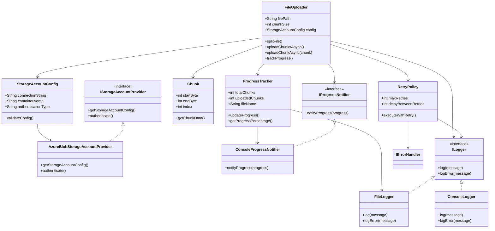

```mermaid
classDiagram
    class StorageAccountConfig {
        +String connectionString
        +String containerName
        +String authenticationType
        +validateConfig()
    }

    class IStorageAccountProvider {
        <<interface>>
        +getStorageAccountConfig()
        +authenticate()
    }

    class AzureBlobStorageAccountProvider {
        +getStorageAccountConfig()
        +authenticate()
    }

    class FileUploader {
        +String filePath
        +int chunkSize
        +StorageAccountConfig config
        +splitFile()
        +uploadChunksAsync()
        +uploadChunkAsync(chunk)
        +trackProgress()
    }

    class Chunk {
        +int startByte
        +int endByte
        +int index
        +getChunkData()
    }

    class RetryPolicy {
        +int maxRetries
        +int delayBetweenRetries
        +executeWithRetry()
    }

    class ProgressTracker {
        +int totalChunks
        +int uploadedChunks
        +String fileName
        +updateProgress()
        +getProgressPercentage()
    }

    class IProgressNotifier {
        <<interface>>
        +notifyProgress(progress)
    }

    class ConsoleProgressNotifier {
        +notifyProgress(progress)
    }

    class ILogger {
        <<interface>>
        +log(message)
        +logError(message)
    }

    class ConsoleLogger {
        +log(message)
        +logError(message)
    }

    class FileLogger {
        +log(message)
        +logError(message)
    }

    StorageAccountConfig --> AzureBlobStorageAccountProvider
    FileUploader --> StorageAccountConfig
    FileUploader --> Chunk
    FileUploader --> RetryPolicy
    FileUploader --> ProgressTracker
    FileUploader --> IProgressNotifier
    FileUploader --> ILogger
    ProgressTracker --> ConsoleProgressNotifier
    ProgressTracker --> FileLogger
    RetryPolicy --> ILogger
    RetryPolicy --> IErrorHandler

    IStorageAccountProvider <|.. AzureBlobStorageAccountProvider
    IProgressNotifier <|.. ConsoleProgressNotifier
    ILogger <|.. ConsoleLogger
    ILogger <|.. FileLogger
```