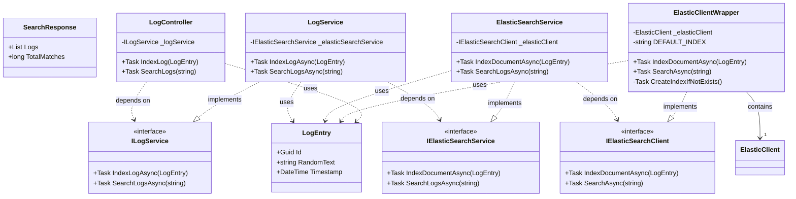

```mermaid
classDiagram
    %% Models
    class LogEntry {
        +Guid Id
        +string RandomText
        +DateTime Timestamp
    }

    class SearchResponse {
        +List<LogEntry> Logs
        +long TotalMatches
    }

    %% Controllers
    class LogController {
        -ILogService _logService
        +Task<IActionResult> IndexLog(LogEntry)
        +Task<IActionResult> SearchLogs(string)
    }

    %% Services
    class ILogService {
        <<interface>>
        +Task IndexLogAsync(LogEntry)
        +Task<SearchResponse> SearchLogsAsync(string)
    }

    class LogService {
        -IElasticSearchService _elasticSearchService
        +Task IndexLogAsync(LogEntry)
        +Task<SearchResponse> SearchLogsAsync(string)
    }

    class IElasticSearchService {
        <<interface>>
        +Task<bool> IndexDocumentAsync(LogEntry)
        +Task<SearchResponse> SearchLogsAsync(string)
    }

    class ElasticSearchService {
        -IElasticSearchClient _elasticClient
        +Task<bool> IndexDocumentAsync(LogEntry)
        +Task<SearchResponse> SearchLogsAsync(string)
    }

    %% Infrastructure
    class IElasticSearchClient {
        <<interface>>
        +Task IndexDocumentAsync(LogEntry)
        +Task<SearchResponse> SearchAsync(string)
    }

    class ElasticClientWrapper {
        -ElasticClient _elasticClient
        -string DEFAULT_INDEX
        +Task IndexDocumentAsync(LogEntry)
        +Task<SearchResponse> SearchAsync(string)
        -Task CreateIndexIfNotExists()
    }

    %% Relationships
    LogController ..> ILogService : depends on
    LogService ..|> ILogService : implements
    LogService ..> IElasticSearchService : depends on
    ElasticSearchService ..|> IElasticSearchService : implements
    ElasticSearchService ..> IElasticSearchClient : depends on
    ElasticClientWrapper ..|> IElasticSearchClient : implements
    ElasticClientWrapper --> "1" ElasticClient : contains
    LogService ..> LogEntry : uses
    ElasticSearchService ..> LogEntry : uses
    ElasticClientWrapper ..> LogEntry : uses
    LogController ..> LogEntry : uses
```