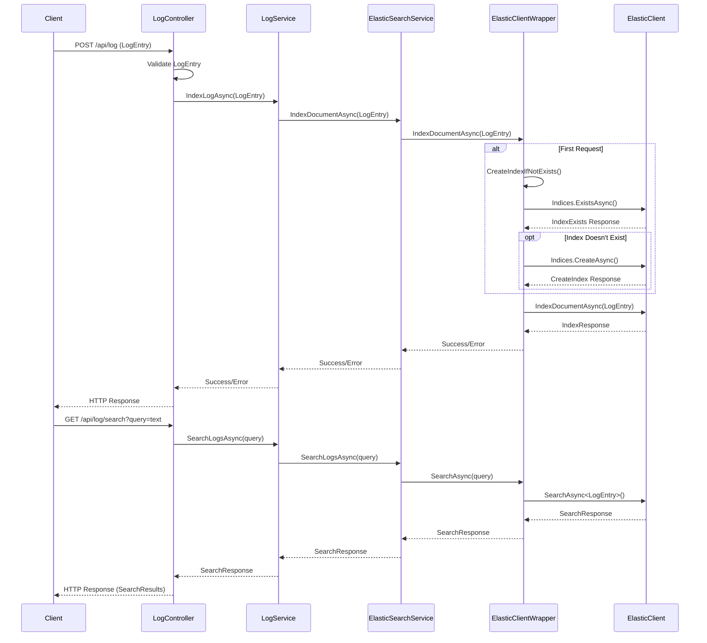

```mermaid
sequenceDiagram
    participant Client
    participant LogController
    participant LogService
    participant ElasticSearchService
    participant ElasticClientWrapper
    participant ElasticClient

    %% Index Log Flow
    Client->>LogController: POST /api/log (LogEntry)
    LogController->>LogController: Validate LogEntry
    LogController->>LogService: IndexLogAsync(LogEntry)
    LogService->>ElasticSearchService: IndexDocumentAsync(LogEntry)
    ElasticSearchService->>ElasticClientWrapper: IndexDocumentAsync(LogEntry)
    
    alt First Request
        ElasticClientWrapper->>ElasticClientWrapper: CreateIndexIfNotExists()
        ElasticClientWrapper->>ElasticClient: Indices.ExistsAsync()
        ElasticClient-->>ElasticClientWrapper: IndexExists Response
        
        opt Index Doesn't Exist
            ElasticClientWrapper->>ElasticClient: Indices.CreateAsync()
            ElasticClient-->>ElasticClientWrapper: CreateIndex Response
        end
    end
    
    ElasticClientWrapper->>ElasticClient: IndexDocumentAsync(LogEntry)
    ElasticClient-->>ElasticClientWrapper: IndexResponse
    ElasticClientWrapper-->>ElasticSearchService: Success/Error
    ElasticSearchService-->>LogService: Success/Error
    LogService-->>LogController: Success/Error
    LogController-->>Client: HTTP Response

    %% Search Logs Flow
    Client->>LogController: GET /api/log/search?query=text
    LogController->>LogService: SearchLogsAsync(query)
    LogService->>ElasticSearchService: SearchLogsAsync(query)
    ElasticSearchService->>ElasticClientWrapper: SearchAsync(query)
    ElasticClientWrapper->>ElasticClient: SearchAsync<LogEntry>()
    ElasticClient-->>ElasticClientWrapper: SearchResponse
    ElasticClientWrapper-->>ElasticSearchService: SearchResponse
    ElasticSearchService-->>LogService: SearchResponse
    LogService-->>LogController: SearchResponse
    LogController-->>Client: HTTP Response (SearchResults)
```