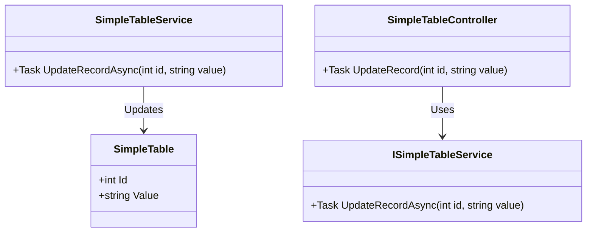

```mermaid
classDiagram
    class SimpleTable {
        +int Id
        +string Value
    }

    class ISimpleTableService {
        +Task UpdateRecordAsync(int id, string value)
    }

    class SimpleTableService {
        +Task UpdateRecordAsync(int id, string value)
    }

    class SimpleTableController {
        +Task<IActionResult> UpdateRecord(int id, string value)
    }

    SimpleTableController --> ISimpleTableService : Uses
    SimpleTableService --> SimpleTable : Updates
```