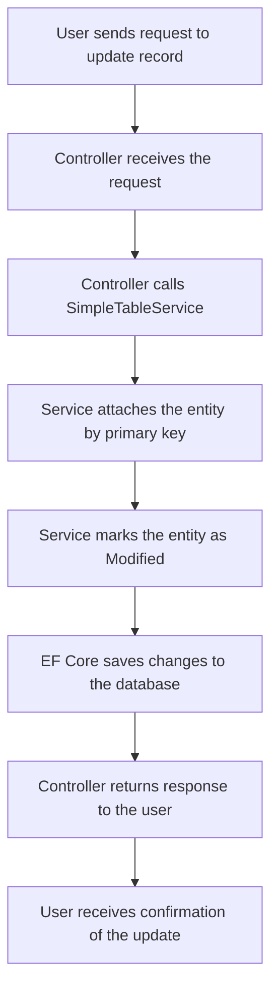

```mermaid
graph TD
    A[User sends request to update record] --> B[Controller receives the request]
    B --> C[Controller calls SimpleTableService]
    C --> D[Service attaches the entity by primary key]
    D --> E[Service marks the entity as Modified]
    E --> F[EF Core saves changes to the database]
    F --> G[Controller returns response to the user]
    G --> H[User receives confirmation of the update]
```