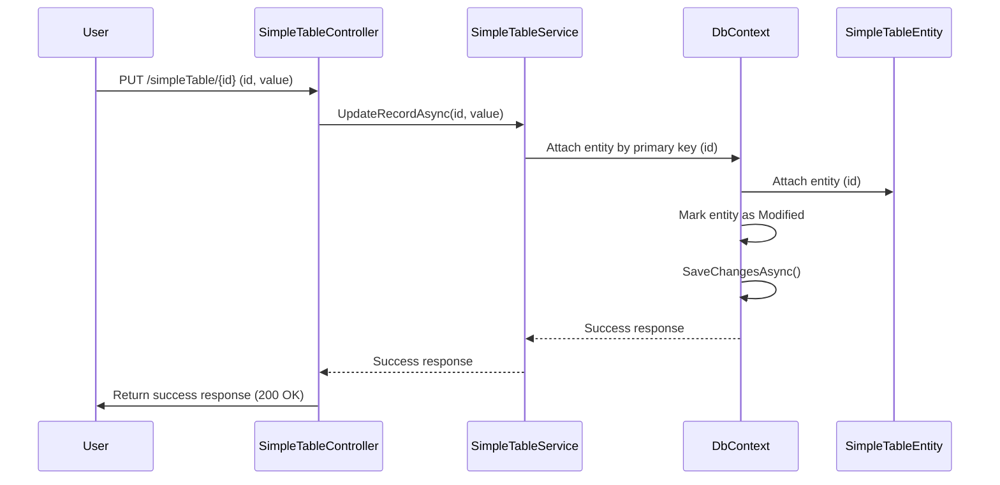

```mermaid
sequenceDiagram
    participant User
    participant SimpleTableController
    participant SimpleTableService
    participant DbContext
    participant SimpleTableEntity

    User->>SimpleTableController: PUT /simpleTable/{id} (id, value)
    SimpleTableController->>SimpleTableService: UpdateRecordAsync(id, value)
    SimpleTableService->>DbContext: Attach entity by primary key (id)
    DbContext->>SimpleTableEntity: Attach entity (id)
    DbContext->>DbContext: Mark entity as Modified
    DbContext->>DbContext: SaveChangesAsync()
    DbContext-->>SimpleTableService: Success response
    SimpleTableService-->>SimpleTableController: Success response
    SimpleTableController->>User: Return success response (200 OK)
```