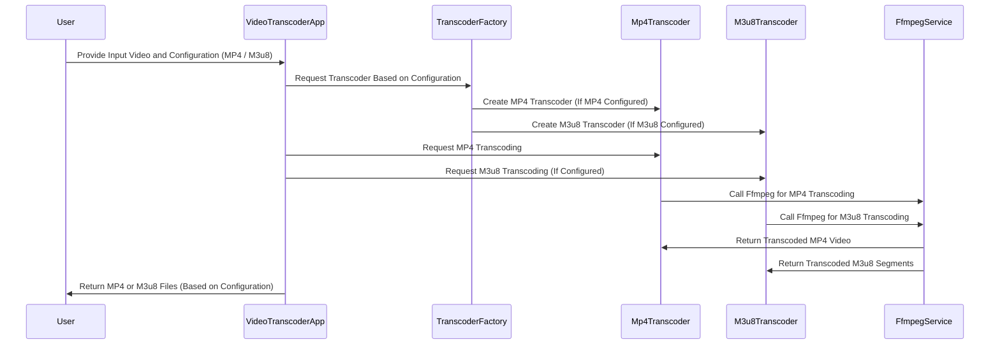

```mermaid
sequenceDiagram
    participant User
    participant VideoTranscoderApp
    participant TranscoderFactory
    participant Mp4Transcoder
    participant M3u8Transcoder
    participant FfmpegService

    User->>VideoTranscoderApp: Provide Input Video and Configuration (MP4 / M3u8)
    VideoTranscoderApp->>TranscoderFactory: Request Transcoder Based on Configuration
    TranscoderFactory->>Mp4Transcoder: Create MP4 Transcoder (If MP4 Configured)
    TranscoderFactory->>M3u8Transcoder: Create M3u8 Transcoder (If M3u8 Configured)
    VideoTranscoderApp->>Mp4Transcoder: Request MP4 Transcoding
    VideoTranscoderApp->>M3u8Transcoder: Request M3u8 Transcoding (If Configured)
    Mp4Transcoder->>FfmpegService: Call Ffmpeg for MP4 Transcoding
    M3u8Transcoder->>FfmpegService: Call Ffmpeg for M3u8 Transcoding
    FfmpegService->>Mp4Transcoder: Return Transcoded MP4 Video
    FfmpegService->>M3u8Transcoder: Return Transcoded M3u8 Segments
    VideoTranscoderApp->>User: Return MP4 or M3u8 Files (Based on Configuration)
```