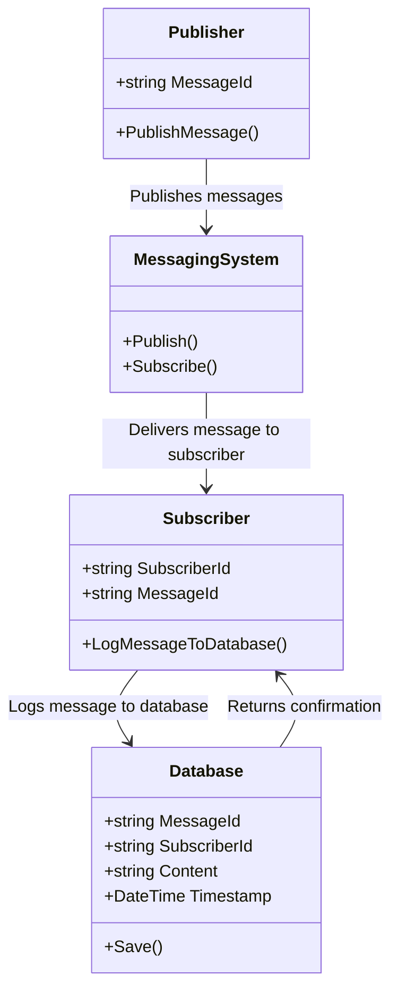

```mermaid
classDiagram
    class Publisher {
        +string MessageId
        +PublishMessage()
    }

    class Subscriber {
        +string SubscriberId
        +string MessageId
        +LogMessageToDatabase()
    }

    class Database {
        +string MessageId
        +string SubscriberId
        +string Content
        +DateTime Timestamp
        +Save()
    }

    class MessagingSystem {
        +Publish()
        +Subscribe()
    }

    Publisher --> MessagingSystem : Publishes messages
    MessagingSystem --> Subscriber : Delivers message to subscriber
    Subscriber --> Database : Logs message to database
    Database --> Subscriber : Returns confirmation
```