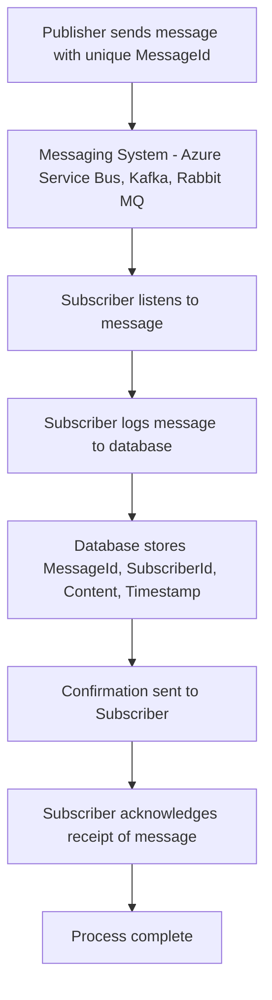

```mermaid
graph TD
    A[Publisher sends message with unique MessageId] --> B[Messaging System - Azure Service Bus, Kafka, Rabbit MQ]
    B --> C[Subscriber listens to message]
    C --> D[Subscriber logs message to database]
    D --> E[Database stores MessageId, SubscriberId, Content, Timestamp]
    E --> F[Confirmation sent to Subscriber]
    F --> G[Subscriber acknowledges receipt of message]
    G --> H[Process complete]
```