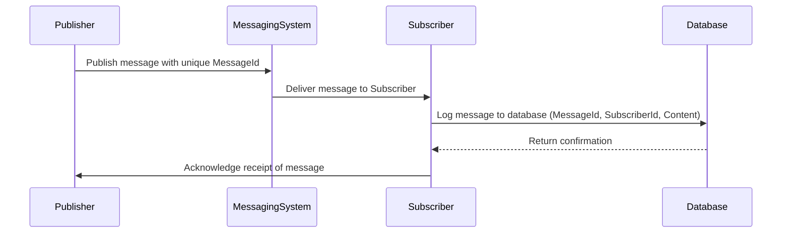

```mermaid
sequenceDiagram
    participant Publisher
    participant MessagingSystem
    participant Subscriber
    participant Database

    Publisher->>MessagingSystem: Publish message with unique MessageId
    MessagingSystem->>Subscriber: Deliver message to Subscriber
    Subscriber->>Database: Log message to database (MessageId, SubscriberId, Content)
    Database-->>Subscriber: Return confirmation
    Subscriber->>Publisher: Acknowledge receipt of message
```